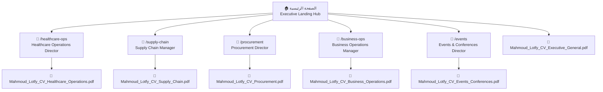

# الدليل التنفيذي الشامل لتصميم ومحتوى الموقع المهني
## Executive Portfolio & Role-Driven Career Hub
### Mahmoud Mohamed Lotfy — `mmlotfy.github.io`

---

> [!NOTE]
> **الغرض من هذا المستند:**  
> تقديم **وصف بصري وهيكلي وتفصيلي كامل** للموقع المنفذ بالفعل؛ بحيث يتمكن أي قارئ متخصص أو مستشار توظيف أو مراجع خارجي من **تخيل شكل الموقع تماماً وكأنه يراه بعينه**، ومراجعة نصوصه ومؤشراته وأقسامه بدقة لإبداء الرأي وتقديم الملاحظات.

---

# الجزء الأول: فلسفة التصميم والهوية البصرية والمعمارية الرقمية

### 1. الفلسفة العامة (Design Persona & Feel)
- **الطابع العام:** الموقع لا يشبه الـ Portfolios الشخصية الاستعراضية، بل صُمم كـ **Executive Operating Dossier (ملف تنفيذي رفيع المستوى)** يشبه التقارير المدققة لمجالس الإدارة (Board-Level Operations Report).
- **الهدف الوظيفي:** إعطاء مسؤول التوظيف (HR) أو المدير التنفيذي (CEO / COO) قدرة على **مسح الموقع وفهم القيمة الحقيقية في 30 إلى 60 ثانية** دون أي تشتيت أو حركات استعراضية بطيئة.
- **قاعدة الإثبات (Zero Fabrication):** كل رقم أو إنجاز مالي أو تشغيلي في الموقع مدعوم بدليل وأرقام رسمية مدققة.

### 2. لوحة الألوان المعتمدة (Color Palette)
| العنصر | كود اللون | الوصف والاستخدام |
| :--- | :--- | :--- |
| **خلفية الموقع العامة** | `#080C0E` | أسود كحلي تنفيذي عميق (Executive Obsidian Dark)، مع توهجات خافتة جداً في الخلفية تعطي عمقاً فخماً. |
| **خلفية الكروت والأقسام** | `#0E1418` | رمادي فحمي داكن مرتفع عن الخلفية مع حدود رفيعة جداً `rgba(255, 255, 255, 0.08)` تعطي فصلاً بصرياً حاداً وأنيقاً. |
| **اللون الزمردي المميز (Primary Accent)** | `#0D6B52` / `#34D399` | أخضر زمردي داكن وفاخر، يمثل الاستقرار والنمو المالي والتشغيلي، ويستخدم للأرقام القياسية والبادجات الإيجابية. |
| **النصوص والعناوين الرئيسية** | `#FFFFFF` | أبيض ناصع مع تباين 100% لسهولة القراءة السريعة. |
| **النصوص الثانوية والفقرات** | `#CBD5E1` & `#94A3B8` | درجات الرمادي الفضي الهادئ غير المجهدة للعين. |
| **كروت التنبيه والتحديات** | `rgba(239, 68, 68, 0.06)` | خلفية حمراء باهتة مع خط أحمر هادئ `#F87171` لعرض "المشاكل التشغيلية" في دراسات الحالة. |

### 3. الخطوط والطباعة (Typography)
- **العناوين الرئيسية (Headings):** خط **Outfit** (أوزان 700 و 800) — خط هندسي حديث، قوي وواضح يعطي انطباعاً قيادياً حاسماً.
- **الفقرات والنصوص (Body Text):** خط **Inter** (أوزان 400 و 500 و 600) — المعيار العالمي للقراءة المريحة على الشاشات.
- **الأرقام والمؤشرات القياسية (Metrics):** خط **JetBrains Mono** — خط أرقام أحادي المسافة (Monospaced) يظهر الأرقام والنسب كبيانات مالية مدققة.

### 4. معمارية الروابط العميقة (Deep Link Architecture)
الموقع **ليس صفحة واحدة طويلة** يضيع فيها القارئ، بل يتكون من **6 صفحات مستقلة تماماً**:

- كل دور وظيفي يمتلك **صفحة مستقلة برابط مخصص** يمكن إرساله للـ HR مباشرة؛ فيفتح مسؤول التوظيف ليجد فقط ما يخص الوظيفة المستهدفة (بدون تشتيت).
- تم إلغاء نسخ الوورد (.docx) والاكتفاء بتحميل **نسخ PDF رسمية معتمدة** تمت تسميتها بأسماء واضحة باسم محمود واسم التخصص.
- التواجد والحراك الجغرافي موحد في جميع الصفحات: **"الإسكندرية، مصر · ومتاح للعمل التنفيذي والحضوري في: القاهرة، الإسكندرية، والشرقية"**.

---

# الجزء الثاني: العناصر الثابتة (Header & Footer)

### 1. الشريط العلوي التنفيذي (Executive Navbar)
- **الشكل والمكان:** شريط عائم مثبت بأعلى الشاشة (Fixed Top) بارتفاع 72px، بخلفية زجاجية معتمة بنسبة 94% بخاصية Blur، وحد سفلي زمردي خافت.
- **الجانب الأيسر (الهوية):**
  - السطر الأول: **MAHMOUD MOHAMED LOTFY** (أبيض، عريض جداً 800).
  - السطر الثاني: **EXECUTIVE CAREER DOSSIER** (أخضر زمردي صغير 0.72rem).
- **المنتصف (روابط التنقل):**
  - `Overview`: يعود للصفحة الرئيسية.
  - `Targeted Dossiers` (قائمة منسدلة أنيقة): تفتح نافذة سوداء بعرض 320px تحتوي على الـ 5 أدوار مع أيقونات ووصف موجز لكل دور.
  - `Methodology`: ينزل بسلاسة لقسم منهجية العمل.
  - `Contact & Mobility`: ينزل لقسم التواصل والتواجد الجغرافي.
- **الجانب الأيمن (الإجراء المباشر):**
  - زر رمادي داكن بحواف مضيئة: `LinkedIn ↗` يفتح البروفايل مباشرة.
  - أيقونة قائمة الموبايل تظهر تلقائياً على الشاشات الصغيرة وتفتح Drawer كامل ومرتب.

### 2. الفوتر التنفيذي (Footer)
- **الشكل والمكان:** خلفية سوداء كاحلة `#05080A` بارتفاع مريح وحد علوي رمادي ناعم.
- **الأعمدة الأربعة:**
  1. **عمود الهوية:** اسم محمود لطفي، التخصصات الرئيسية، ومقولته التنفيذية: *"I solve operational and business problems by connecting strategy, execution, financial discipline, people, and process."*
  2. **عمود الملفات التخصصية (Targeted Dossiers):** روابط مباشرة لصفحات الأدوار الخمسة.
  3. **عمود الروابط التنفيذية (Executive Hub):** روابط Overview، المنهجية، التواصل، ورابط مباشر باللون الزمردي لتحميل السيرة الذاتية العامة: `Executive General CV (PDF)`.
  4. **عمود قنوات الاتصال:** الإيميل المباشر، رقم الهاتف، ورابط بروفايل LinkedIn، وزر دائري أنيق `Back to Top ↑`.
- **الشريط السفلي:** حقوق الملكية لسنة 2026 + عبارة: `Alexandria, Egypt · Available for: Cairo, Alexandria & Sharkia`.

---

# الجزء الثالث: تفصيل الصفحة الرئيسية (Page 1: Executive Landing Hub)

هذه الصفحة صُممت كـ "بوابة تنفيذية شاملة" لأي زائر، وتعرض القيمة الكلية في تتابع هرمي دقيق:

```
[ شريط التنقل العلوي Executive Navbar ]
       ↓
[ 1. قسم البطل Hero: الاسم + الصفة + البادجات + ملخص التموضع + أزرار الدعوة ]
       ↓
[ 2. شريط الأرقام القياسية الكبرى (6 Career Proof Metrics) ]
       ↓
[ 3. مسارات الأدوار المتخصصة (Targeted Executive Dossiers: 5 كروت كاملة) ]
       ↓
[ 4. التطور والمسار المهني عبر 15+ عاماً (3 مراحل واقعية متتابعة) ]
       ↓
[ 5. كيف أفكر: إطار العمل التشغيلي من 7 خطوات (The 7-Step Framework) ]
       ↓
[ 6. قنوات التواصل والتواجد الجغرافي (Initiate Direct Dialogue) ]
       ↓
[ الفوتر التنفيذي Footer ]
```

---

### القسم الأول: Hero — التعريف والتموضع الاستراتيجي
- **البادجات العلوية (Top Pill Badges):**
  - بادج زمردي بيضاوي: `🛡️ EXECUTIVE CAREER PROFILE · VERIFIED EVIDENCE`
  - بادج رمادي بمؤشر خريطة: `📍 Alexandria, Egypt · Available for: Cairo, Alexandria & Sharkia`
- **العناوين الرئيسية:**
  - العنوان الكبير (H1): **Mahmoud Mohamed Lotfy** (أبيض، خط Outfit عريض جداً 3.8rem).
  - اللقب التنفيذي: **Healthcare Operations Director · Supply Chain & Business Operations** (أخضر زمردي لامع 1.6rem).
  - السطر التعريفي الشامل:
    > *"15+ years of multi-sector professional leadership across healthcare clinical administration, mission-critical medical supply chain, strategic procurement, and business improvement."*
- **صندوق ملخص التموضع (Executive Positioning Box):**
  - **الشكل:** كارت أسود عريض بحافة يسرى سميكة زمردية بلون `#1D9E75` وخلفية `#0E1418`.
  - **العنوان:** `EXECUTIVE POSITIONING SUMMARY` (أخضر كابيتال صغير).
  - **النص المكتوب داخله بالخط المائل:**
    > *"Business operations and management professional with 15+ years across operations, supply chain, procurement, financial management, inventory, team leadership, and business improvement — including 5+ years in healthcare operations. My management approach combines market awareness, financial discipline, and operational execution."*
- **أزرار الدعوة للإجراء (Action Buttons):**
  1. زر رئيسي زمردي مشع: `Select Targeted Dossier →` ينقل الزائر مباشرة لكروت التخصصات.
  2. زر رمادي أنيق مع أيقونة تحميل: `Download Executive General CV (PDF)` يحمل ملف `Mahmoud_Lotfy_CV_Executive_General.pdf`.
  3. زر نصي ناعم مع أيقونة رسالة: `Initiate Direct Dialogue` ينزل لقسم التواصل.

---

### القسم الثاني: شريط الأرقام القياسية (Career Metrics Bar)
- **الشكل والتوزيع:** شبكة متناسقة من 6 كروت مربعة الشكل (`minmax(180px, 1fr)`).
- **التصميم:** كل كارت بلون `#0E1418`، والرقم مكتوب بخط أحادي بارز بحجم 2.1rem، وتحته مسمى الرقم، وتحته سطر بالرمادي الفاتح يوضح مصدر التوثيق.
- **محتوى الكروت الستة بالتفصيل:**
  1. **الكارت الأول (مميز بإطار زمردي مشع):**
     - الرقم: **`+56.3%`** (أخضر زمردي)
     - المسمى: `Net Profit Growth YoY`
     - التوثيق: `Audited H1 2024 vs H1 2025 under >70% cost inflation`
  2. **الكارت الثاني (مميز بإطار زمردي مشع):**
     - الرقم: **`+37.0%`** (أخضر زمردي)
     - المسمى: `Revenue 3-Year CAGR`
     - التوثيق: `Official hospital financial audit across 3 consecutive years`
  3. **الكارت الثالث (مميز بإطار زمردي مشع):**
     - الرقم: **`ZERO`** (أخضر زمردي)
     - المسمى: `Supply Failure Cancellations`
     - التوثيق: `30+ consecutive months with 100% procedure readiness`
  4. **الكارت الرابع:**
     - الرقم: **`~45 Staff`** (أبيض)
     - المسمى: `Personnel Oversight`
     - التوثيق: `Nursing staff, surgical technicians, coordinators & admin`
  5. **الكارت الخامس:**
     - الرقم: **`20+ Events`** (أبيض)
     - المسمى: `Direct Events Executed`
     - التوثيق: `Zagazig Med Faculty congresses, Cairo Derma, TEDx Zagazig`
  6. **الكارت السادس:**
     - الرقم: **`15+ Years`** (أبيض)
     - المسمى: `Multi-Sector Experience`
     - التوثيق: `Healthcare clinical operations, FMCG warehousing, commercial media`

---

### القسم الثالث: مسارات الأدوار المتخصصة (Targeted Executive Dossiers)
- **الشكل العام:** شبكة كروت تنفيذية واسعة (`minmax(340px, 1fr)`). كل كارت مزود بتأثير حركي ناعم (Hover Lift) مع إضاءة خفيفة للحدود عند اقتراب الفأرة.
- **محتوى الكروت الخمسة:**

#### 1. كارت: Healthcare Operations Director
- **الأيقونة:** نبض القلب الطبي `Activity` داخل مربع زمردي.
- **البادج العلوي:** `CLINICAL & HOSPITAL LEADERSHIP`
- **العنوان:** **Healthcare Operations Director**
- **العنوان الفرعي:** Cardiac Catheterization Unit · Clinical Workflows · Zero Supply Disruptions
- **نص الكارت:**
  > *"Direct management of a high-volume interventional Cardiac Catheterization Unit (90–140 cases/mo), delivering +56.3% YoY net profit growth and zero procedural cancellations across 30+ months."*
- **شريط الأرقام الثلاثية داخل الكارت:**
  - `+56.3%` Net Profit YoY | `90–140` Monthly Procedures | `ZERO` Supply Cancellations
- **الأزرار السفلية:**
  - زر نصي زمردي: `Open Role Dossier →` ينقل لصفحة `/#/healthcare-ops`.
  - زر رمادي جانبي: `CV PDF` يحمل مباشرة `Mahmoud_Lotfy_CV_Healthcare_Operations.pdf`.

#### 2. كارت: Supply Chain Manager
- **الأيقونة:** شاحنة لوجستية `Truck`.
- **البادج العلوي:** `MEDICAL DEVICES & CRITICAL CONSUMABLES`
- **العنوان:** **Supply Chain Manager**
- **العنوان الفرعي:** Procedure-Linked Demand Models · 1-Hour SLAs · Zero Stockouts
- **نص الكارت:**
  > *"Engineered procedure-linked demand forecasting models that reduced emergency purchasing by 40–60%, maintained 100% stock availability for 3 fiscal years, and enforced 1-Hour emergency vendor SLAs."*
- **شريط الأرقام الثلاثية:**
  - `-40% to -60%` Emergency Orders | `100%` Stock Availability | `1-Hr MAX` Vendor SLA
- **الأزرار السفلية:**
  - `Open Role Dossier →` ينقل لصفحة `/#/supply-chain`.
  - `CV PDF` يحمل `Mahmoud_Lotfy_CV_Supply_Chain.pdf`.

#### 3. كارت: Procurement Director
- **الأيقونة:** حقيبة الشراء والمناقصات `ShoppingBag`.
- **البادج العلوي:** `STRATEGIC SOURCING & COMMERCIAL GOVERNANCE`
- **العنوان:** **Procurement Director**
- **العنوان الفرعي:** 3-Criteria Sign-Off · Currency Crisis Resilience · Contract Auditing
- **نص الكارت:**
  > *"Instituted a 3-criteria procurement sign-off protocol, audited 100% of supplier invoices against master price books, and absorbed >70% currency-driven inflation through forward volume deals."*
- **شريط الأرقام الثلاثية:**
  - `>70%` Inflation Absorbed | `20–30%` Overdue Balances Cut | `250%` Commercial ROMI
- **الأزرار السفلية:**
  - `Open Role Dossier →` ينقل لصفحة `/#/procurement`.
  - `CV PDF` يحمل `Mahmoud_Lotfy_CV_Procurement.pdf`.

#### 4. كارت: Business Operations Manager
- **الأيقونة:** حقيبة الأعمال التنفيذية `Briefcase`.
- **البادج العلوي:** `CROSS-FUNCTIONAL OPERATIONS & P&L`
- **العنوان:** **Business Operations Manager**
- **العنوان الفرعي:** Full P&L Stewardship (~20% Revenue) · Systemic Scaling · Margin Protection
- **نص الكارت:**
  > *"Led departmental P&L accountability contributing ~20% of hospital revenue, restructured operations through a 7-step execution framework, and delivered compounding profit expansion."*
- **شريط الأرقام الثلاثية:**
  - `~20%` Hospital Revenue | `100%` Process Digitization | `+56.3%` Net Profit YoY
- **الأزرار السفلية:**
  - `Open Role Dossier →` ينقل لصفحة `/#/business-ops`.
  - `CV PDF` يحمل `Mahmoud_Lotfy_CV_Business_Operations.pdf`.

#### 5. كارت: Events & Conferences Director
- **الأيقونة:** تقويم الفعاليات `Calendar`.
- **البادج العلوي:** `MEDICAL CONGRESSES & MEDIA OPERATIONS`
- **العنوان:** **Events & Conferences Director**
- **العنوان الفرعي:** 20+ Executed Events · Zagazig Med Faculty & Cairo Derma · TEDx Zagazig Co-Founder
- **نص الكارت:**
  > *"Directed 20+ large-scale events and medical congresses for Zagazig University Faculty of Medicine and Egyptian medical societies, co-founded TEDx Zagazig, and spent 5 years in commercial media production."*
- **شريط الأرقام الثلاثية:**
  - `20+ Events` Executed Events | `Multiple Depts` Medical Congresses | `2,000+` Job Fair Scale
- **الأزرار السفلية:**
  - `Open Role Dossier →` ينقل لصفحة `/#/events`.
  - `CV PDF` يحمل `Mahmoud_Lotfy_CV_Events_Conferences.pdf`.

---

### القسم الرابع: التطور والمسار المهني عبر 15+ عاماً (Cross-Sector Evolution)
- **الغرض التنفيذي:** يوضح كيف أن مهارات محمود ليست مجرد خبرة في مكان واحد، بل سلسلة تراكمية متكاملة تفسر تميزه.
- **التصميم:** 3 كروت مستطيلة عريضة متتابعة رأسياً، كل كارت يمثل مرحلة كاملة:

```
[ المرحلة الأولى: الفعاليات والمؤتمرات الطبية الحية والإنتاج الإعلامي (2011–2014) ]
                                ↓
[ المرحلة الثانية: إدارة المستودعات وحفظ الخامات بنظام FIFO بمصنع حلويات (2015–2017) ]
                                ↓
[ المرحلة الثالثة: قيادة العمليات الصحية وإدارة الـ P&L بقسطرة القلب (2018–2026) ]
```

- **نصوص المراحل الثلاث بالتفصيل:**
  1. **Phase 1: High-Stakes Live Execution & Media Production (2011 – 2014)**
     - التخصص: `Events, Media Production & Entrepreneurship`
     - السرد: *"Organized premier medical congresses for Zagazig University Faculty of Medicine departments (Vascular Surgery, Cairo Derma) and co-founded TEDx Zagazig. Directed on-site operations for high-budget commercial TV campaigns (Vodafone, Huawei) managing 50+ personnel crews under extreme time sensitivity and financial penalties."*
     - الخلاصة القيادية: `Core Leadership Takeaway: Mastered high-tempo execution, stakeholder protocol, and zero-defect live delivery.`
  2. **Phase 2: Stores, Inventory & Raw Material Control (2015 – 2017)**
     - التخصص: `Sweets & Confectionery Facility (Verona Sweets / IBS)`
     - السرد (بشكل دقيق وواقعي دون أي تضخيم): *"Supervised stores, raw material staging, packaging, and finished goods inventory for a local confectionery manufacturing business. Enforced strict FIFO stock rotation to prevent ingredient spoilage, synchronized daily material staging with production shift requirements, and maintained clean physical vs ledger records."*
     - الخلاصة القيادية: `Core Leadership Takeaway: Built foundational discipline in inventory accuracy, FIFO physical stock rotation, and raw material waste prevention.`
  3. **Phase 3: Specialized Healthcare Operations & P&L Leadership (2018 – 2026)**
     - التخصص: `Healthcare Clinical Administration & Cath Lab (Al-Obour Hospital)`
     - السرد: *"Directed end-to-end clinical operations of a high-volume Cardiac Catheterization Unit (90–140 procedures/month) with full P&L ownership representing ~20% of hospital revenue. Delivered +56.3% YoY net profit growth and zero supply failure cancellations across 30+ months under >70% currency-driven cost inflation."*
     - الخلاصة القيادية: `Core Leadership Takeaway: Integrated financial discipline, clinical governance, and mission-critical supply resilience.`

---

### القسم الخامس: منهجية التفكير الشاملة (How I Think: The 7-Step Framework)
- **الغرض:** شرح الطريقة المنطقية التي يعالج بها محمود أي مشكلة تشغيلية (منهج عام ومطلق لكل القطاعات).
- **كارت الفلسفة التأسيسية الذهبي (The Names Came Later):**
  - كارت فخم بحد أيسر ذهبي `#E5A93C` وأيقونة مصباح.
  - المقولة: *"I built systems because operations demanded them; the academic names—DMAIC, Deming Cycle (PDCA), Lean Six Sigma—came later, validating what instinct, observation, and relentless data tracking had already created."*
  - النص العام المدقق:
    > *"When facing an operational unit in distress and fragmented workflows—whether in healthcare administration, factory warehousing, or high-stakes live productions—you don't quote textbooks; you fix the broken pipeline. You go to the floor, identify why materials are missing, build tailored systems to stop unrecorded leakage, restructure supplier agreements to eliminate emergency surcharges, and train the staff until zero mistakes happen. Only years later did I study the formal literature and realize that my intuitive process mapped directly to the highest methodologies of industrial operations and Lean Six Sigma."*
- **المتصفح التفاعلي للخطوات السبع:**
  - شريط أزرار علوي يتنقل بين الخطوات: `OBSERVE` → `UNDERSTAND` → `DESIGN` → `BUILD` → `EXECUTE` → `MEASURE` → `IMPROVE`.
  - بطاقة عريضة تعرض الخطوة المختارة بالتفصيل: الإجراء الفعلي (Action)، الوصف (Description)، الأدوات المستخدمة (Tools)، والدليل الواقعي المحقق (Evidence).

---

### القسم السادس: التواصل والتواجد الجغرافي (Initiate Direct Dialogue)
- **الشكل:** مقسم لعمودين رئيسيين:
  - **العمود الأيسر (Direct Channels):**
    - كارت الإيميل الرسمي: `m.m.lotfy.88@gmail.com` مع أيقونة رسالة زمردية.
    - كارت الهاتف والواتساب المباشر: `+20 155 816 6440` مع أيقونة اتصال وزر يفتح محادثة واتساب فوراً.
    - كارت شبكة الأعمال: `linkedin.com/in/mmlotfy` مع أيقونة لينكد إن زرقاء.
    *(تمت إزالة بطاقة GitHub بالكامل).*
  - **العمود الأيمن (Mobility & Geographic Scope):**
    - الموقع الحالي: `Alexandria, Egypt`
    - المنشأ وقاعدة العمليات: `Zagazig, Sharkia, Egypt`
    - الجاهزية للعمل الحضوري والتنفيذي: `Cairo • Alexandria • Sharkia, Egypt`
    - بوكس زمردي أسفله يؤكد: الجاهزية للبدء الفوري، والتفرغ للأدوار القيادية والاستشارات التشغيلية.

---

# الجزء الرابع: تفصيل الصفحات التخصصية الخمس (Role-Specific Pages)

صُممت كل صفحة من الصفحات الخمس لتكون **سيرة ذاتية تفاعلية مدعومة بالأدلة (Evidence-Based Dossier)** لا تستغرق قراءتها أكثر من دقيقتين.

---

## 🏥 الصفحة الثانية: Healthcare Operations Director
**الرابط المباشر:** `mmlotfy.github.io/#/healthcare-ops`

### 1. رأس الصفحة (Role Hero):
- مسار العودة: `← Back to Executive Career Hub`
- بادج: `CARDIAC CATHETERIZATION & CLINICAL OPERATIONS`
- العنوان الكبير: **Healthcare Operations Director**
- العنوان الفرعي: High-Volume Cath Lab Leadership · Clinical Workflow Turnaround · Zero-Failure Supply Governance
- **صندوق القيمة المقترحة (Value Proposition Box):**
  > *"Managed end-to-end operations of a high-volume Cardiac Catheterization Unit (90–140 procedures/month), delivering +56.3% YoY net profit growth while maintaining ZERO supply failures across 30+ months — under >70% macroeconomic cost inflation."*
- **شريط تحميل الملف والتواصل:**
  - زر زمردي وحيد: `Download Healthcare Operations CV (PDF)` (يحمل `Mahmoud_Lotfy_CV_Healthcare_Operations.pdf`).
  - أزرار سريعة لمراسلة الإيميل أو الاتصال بالهاتف مباشرة.

### 2. شبكة الأرقام المدققة (6 Key Metrics):
1. `+56.3%` Net Profit Growth YoY (Audited H1 2024 vs H1 2025 under >70% cost inflation)
2. `+37.0%` Revenue 3-Year CAGR (Official hospital financial audit across 3 consecutive years)
3. `ZERO` Supply Failure Cancellations (30+ consecutive months with 100% procedure readiness)
4. `90–140` Monthly Procedure Volume (Diagnostic angiographies, PCIs, and pacemaker implants)
5. `~45 Staff` Team Leadership (Nursing staff, surgical technicians, coordinators & admin)
6. `100%` Equipment Readiness (Zero unplanned imaging shutdowns; 1-Hour MAX vendor SLA)

### 3. دراسات الحالة الثلاث (Problem → Action → Result):
- **قصة 1: From Clinical Accountant to Operations Lead**
  - *المشكلة:* عزلة وحدة القسطرة إدارياً عن إدارة المستشفى وتضارب أولويات الجراحين والتمريض والمحاسبين مما تسبب في هدر مستلزمات غير مسجلة وبطء خروج المرضى.
  - *ما رأيته وما فعلته:* رسمت دورة حياة المريض والمستلزمات خطوة بخطوة، وقدمت خطة إعادة هيكلة شاملة لإدارة المستشفى وتم تكليفي بقيادة العمليات لتوحيد الرؤية.
  - *ما بنيته:* بروتوكولات تشغيل يومية قياسية، ونماذج استهلاك سريري متزامنة، وجلسات تنسيق دورية مع استشاريي القلب ورئيسة التمريض.
  - *النتيجة المدققة:* إنهاء الاحتكاك الإداري، مواءمة جداول الجراحة مع توفر المستلزمات، وإعادة ربط الوحدة بالحوكمة المركزية للمستشفى.
- **قصة 2: Zero Supply Cancellations for 30+ Consecutive Months**
  - *المشكلة:* الاعتماد على الطلب العشوائي للدعامات والبالونات المستوردة الباهظة، والتعرض لخطر تأجيل عمليات طارئة أو الشراء الفوري بزيادة 40%.
  - *ما رأيته وما فعلته:* بناء نموذج تنبؤ طلب ديناميكي مرتبط بقوائم العمليات المحجوزة واستشاريي القسطرة، والتفاوض على اتفاقية طوارئ ملزمة بتوريد أي مقاس نادر خلال ساعة واحدة كحد أقصى (1-Hour MAX SLA).
  - *ما بنيته:* نظام إدارة مخزون رقمي مزود بقراءة الباركود، وتنبيهات إعادة الطلب الآلية، ودفاتر تدقيق مخزون الأمانة (Consignment).
  - *النتيجة المدققة:* صفر إلغاء للعمليات بسبب نقص المستلزمات على مدار 30+ شهراً متتالياً، وتوفير 100%، وخفض الطلبات الطارئة بنسبة 40–60%.
- **قصة 3: Delivering +56.3% Net Profit Under Severe Cost Inflation**
  - *المشكلة:* قفزة في تكاليف المستلزمات الطبية المستوردة بنسبة +69.9% نتيجة تعويم الجنيه، مما هدد بهبوط أرباح الوحدة إلى خسائر تشغيلية.
  - *ما رأيته وما فعلته:* تطبيق التسعير الديناميكي المرتبط بتكلفة الاستبدال الفعلي، وتدقيق 100% من فواتير الموردين، وإعادة توجيه الطاقة التشغيلية بعد الظهر لحالات القسم الخاص (Private) ذات الهامش الربحي المرتفع (+50% نمو)، مع إطلاق برنامج تواصل مباشر مع أطباء القلب حقق عائداً تسويقياً 250% ROMI.
  - *النتيجة المدققة:* تحقيق صافي ربح قياسي بلغ 2,978,995 جنيه في النصف الأول 2025 (+56.3% نمو)، ونمو الإيرادات الإجمالية +65.5%، والمساهمة بـ ~20% من استقرار إيرادات المستشفى.

### 4. التمكين الرقمي (Digital Enabler Box):
- يوضح الأنظمة التي بناها محمود لخدمة القسم بصفر ميزانية خارجية:
  1. *منظومة مؤشرات أداء التمريض (Nursing KPI System):* متابعة shift التمريض ومكافحة العدوى وتقييم 45 فرداً بموضوعية.
  2. *نظام التقارير الطبية (Medical Diagnostic Reports):* قوالب رقمية موحدة لتقارير القسطرة لمنع ضياع التقارير وتسريع خروج المريض.
  3. *نظام تتبع مخزون القسطرة والباركود:* تتبع الدعامات والبالونات وتواريخ الصلاحية آلياً.

### 5. الكفاءات والتاريخ المهني المفلتر:
- الكفاءات: إدارة الوحدات الإكلينيكية، حوكمة P&L، سلاسل الإمداد ومخزون الأمانة، قيادة فرق العمل، الحوكمة والامتثال للرقابة الصحية.
- التاريخ المهني المعروض: قصر العرض على مستشفى العبور (2019–2026) وشركة برمجيات العمليات الصحية ClinPrime (2018–2019).

---

## 🔗 الصفحة الثالثة: Supply Chain Manager
**الرابط المباشر:** `mmlotfy.github.io/#/supply-chain`

### 1. رأس الصفحة (Role Hero):
- بادج: `MEDICAL DEVICES & CRITICAL CONSUMABLES`
- العنوان: **Supply Chain Manager**
- العنوان الفرعي: Demand Forecasting · Consignment Governance · 1-Hour Emergency SLAs · Zero Disruptions
- **القيمة المقترحة:**
  > *"Built and managed a procedure-linked demand forecasting model that reduced emergency purchasing by 40–60%, maintained 100% stock availability across 3 fiscal years, and achieved ZERO supply disruptions for 30+ consecutive months — in a high-value medical consumables environment under >70% cost inflation."*
- **زر التحميل:** `Download Supply Chain Management CV (PDF)` (ملف `Mahmoud_Lotfy_CV_Supply_Chain.pdf`).

### 2. شبكة الأرقام المدققة:
1. `ZERO` Supply Disruptions (30+ consecutive months with zero supply cancellations)
2. `40–60%` Emergency Purchasing Reduction (Transitioned from panic spot buys to scheduled weekly replenishment)
3. `100%` Critical Stock Availability (Maintained continuously across 3 consecutive fiscal years)
4. `1 Hour MAX` Vendor Emergency Response SLA (Contractually enforced response time for specialized surgical sizes)
5. `100%` Physical vs Ledger Accuracy (Zero stock discrepancy across 50+ critical surgical item codes)
6. `>70%` Cost Inflation Absorbed (Absorbed foreign currency import spikes through forward volume deals)

### 3. دراسات الحالة الثلاث:
- **قصة 1: The Procedure-Linked Demand Replenishment Engine:** تحويل إعادة الطلب من العشوائية إلى خوارزمية مرتبطة بحجوزات القسطرة وسرعة استهلاك كل استشاري، وخفض الشراء الفوري 40-60%.
- **قصة 2: Negotiating the 1-Hour MAX Emergency Vendor SLA:** إلزام الموردين بتوفير المقاسات النادرة في الحالات الحرجة خلال 60 دقيقة دون الحاجة لتجميد رأس مال المستشفى في شرائها وتخزينها مسبقاً.
- **قصة 3: Maintaining Unbroken Supply Chains Through Currency Collapse:** استمرار توريد الدعامات والقساطر أثناء ذروة أزمة الدولار الموازي (70-72 جنيه) عبر التوريد المزدوج والالتزام بحصص الشراء المسبقة بينما توقفت المستشفيات المنافسة.

### 4. التمكين الرقمي والكفاءات والتاريخ المفلتر:
- التمكين الرقمي: نظام تتبع مخزون القسطرة بالباركود + محرك حساب نقاط إعادة الطلب ومخزون الأمان تلقائياً.
- الكفاءات: تخطيط الطلب والتنبؤ، حوكمة مخزون الأمانة، إدارة عقود الموردين وSLAs، استراتيجية مخزون الأمان.
- التاريخ المعروض: مستشفى العبور (2019–2026) + مصنع فيرونا (2015–2017) كمشرف مستخزن وخامات وتطبيق FIFO.

---

## 🛒 الصفحة الرابعة: Procurement Director
**الرابط المباشر:** `mmlotfy.github.io/#/procurement`

### 1. رأس الصفحة (Role Hero):
- بادج: `STRATEGIC SOURCING & COMMERCIAL NEGOTIATIONS`
- العنوان: **Procurement Director**
- العنوان الفرعي: 3-Criteria Sign-Off · Inflation Absorption (>70%) · Master Price Books · Working Capital Recovery
- **القيمة المقترحة:**
  > *"Strategic procurement leader who instituted a rigorous 3-criteria sign-off protocol, managed high-value medical consumables procurement under extreme currency devaluation (~38% official + 70–72 EGP/USD parallel), and maintained cost discipline while absorbing >70% inflation."*
- **زر التحميل:** `Download Procurement & Sourcing CV (PDF)` (ملف `Mahmoud_Lotfy_CV_Procurement.pdf`).

### 2. شبكة الأرقام المدققة:
1. `40–60%` Emergency Purchasing Reduction (Eliminated premium spot pricing and rush freight surcharges)
2. `>70%` Cost Inflation Absorbed (Actual departmental expenditure held at +69.9% despite massive import spikes)
3. `20–30%` Outstanding Balances Recovered (Restructured receivables and vendor reconciliation backlogs)
4. `100%` Invoices Audited (Zero invoices settled without verification against contracted master price books)
5. `3 Criteria` Procurement Sign-Off Protocol (Unit price benchmark, clinical suitability, and regulatory compliance)
6. `250%` Commercial Marketing ROMI (Return on outreach investment connecting physician referrals to procedure bookings)

### 3. دراسات الحالة الثلاث:
- **قصة 1: Instituting the 3-Criteria Procurement Sign-Off Protocol:** إلغاء الشراء الفردي والمجاملات عبر اشتراط 3 معايير (سعر الوحدة مقابل قائمة الأسعار المعتمدة، الملاءمة الفنية من الاستشاري، ومطابقة الصلاحية والفاتورة الضريبية).
- **قصة 2: Strategic Procurement in a Crashing Currency Market:** امتصاص قفزات أسعار الموردين (50-90%) عبر عقود التوريد المزدوج وتثبيت الأسعار بالكميات السنوية وربط التعديل بالسعر الرسمي وليس أهواء المورد.
- **قصة 3: Restructuring Balances and Recapturing Working Capital:** مراجعة وتسوية مديونيات متراكمة لـ 3 سنوات مالية، وربط مستندات الصرف بفواتير المرضى وخفض المتأخرات 20-30%.

### 4. التمكين الرقمي والكفاءات والتاريخ المفلتر:
- التمكين الرقمي: نظام الخزينة والمدفوعات المبني برمجياً، ونماذج Excel المتقدمة لمطابقة الفواتير بقوائم الأسعار التعاقدية.
- الكفاءات: الشراء الاستراتيجي، التفاوض التجاري، مراجعة وتدقيق الفواتير بنسبة 100%، إدارة السيولة النقدية ورأس المال العامل.
- التاريخ المعروض: مستشفى العبور (2019–2026) + فيرونا (2015–2017) كمنسق مشتريات خامات ومستلزمات تعبئة.

---

## 🏢 الصفحة الخامسة: Business Operations Manager
**الرابط المباشر:** `mmlotfy.github.io/#/business-ops`

### 1. رأس الصفحة (Role Hero):
- بادج: `CROSS-FUNCTIONAL LEADERSHIP & P&L STEWARDSHIP`
- العنوان: **Business Operations Manager**
- العنوان الفرعي: P&L Ownership (~20% Hospital Revenue) · Operational Discipline · Zero-Budget Systems · Compounding Growth
- **القيمة المقترحة:**
  > *"Cross-functional operations leader with full P&L accountability (~20% of hospital revenue), building high-governance KPI systems and delivering 3 consecutive years of compounding profit growth — proving that systemic execution (observe → measure → build → improve) applies across healthcare, manufacturing, FMCG, and complex multi-stakeholder operations."*
- **زر التحميل:** `Download Business Operations CV (PDF)` (ملف `Mahmoud_Lotfy_CV_Business_Operations.pdf`).

### 2. شبكة الأرقام المدققة:
1. `+56.3%` Net Profit Growth YoY (Audited H1 2024 vs H1 2025 reaching record EGP 2,978,995)
2. `+37.0%` Revenue 3-Year CAGR (Consistent compounding top-line expansion across 3 fiscal years)
3. `~20%` Hospital Revenue Share (Unit operates as the primary financial stability engine for the entire facility)
4. `100%` Process Digitization (Complete operational digitization on Day 1 at zero external software cost)
5. `~45 Staff` Cross-Functional Team (Clinicians, nursing supervisors, technicians, administrative and support staff)
6. `3,570+ Hrs` Development Investment (Personally engineered 4 enterprise web platforms and 6 analytical modules)

### 3. دراسات الحالة الثلاث:
- **قصة 1: The Transferable Operational Value Chain:** نقل مبادئ الانضباط التصنيعي وإدارة الوقت في الإعلانات إلى المستشفى، وتجهيز أطقم المستلزمات مسبقاً، ورفع عدد الحالات من 90 إلى 140 شهرياً (+37.8%) دون إضافة غرف أو ساعات إضافية.
- **قصة 2: 3 Years of Compounding Discipline:** كيف قادت العادات اليومية الصارمة (مطابقة الاستهلاك، مراجعة الفواتير الأسبوعية، تقييم التمريض، مراجعة مزيج الحالات) إلى مضاعفة صافي الأرباح.
- **قصة 3: Building Enterprise Infrastructure with Zero Budget:** بناء 4 منصات برمجية كاملة بدلاً من انتظار ملايين الجنيهات لشراء أنظمة ERP جاهزة في ظل أزمة العملة.

### 4. التمكين الرقمي والكفاءات والتاريخ:
- التمكين الرقمي: استعراض شامل للأنظمة الأربعة (إدارة النقدية، إدارة المخزون، التقارير الطبية، تقييم أداء التمريض) باستثمار 3,570 ساعة عمل.
- الكفاءات: إدارة الـ P&L الشاملة، تصميم وتوحيد تدفقات العمل SOPs، هندسة مؤشرات الأداء KPIs، قيادة الفرق المتعددة التخصصات.
- التاريخ المعروض: التاريخ المهني الكامل لتأكيد شمولية وقوة خبرة إدارة الأعمال عبر القطاعات المتعددة.

---

## 🎪 الصفحة السادسة: Events & Conferences Director
**الرابط المباشر:** `mmlotfy.github.io/#/events`

### 1. رأس الصفحة (Role Hero):
- بادج: `MEDICAL CONGRESSES & HIGH-STAKES PRODUCTION`
- العنوان: **Events & Conferences Director**
- العنوان الفرعي: 20+ Executed Events · Zagazig Med Faculty & Cairo Derma · TEDx Zagazig Co-Founder · Commercial Media Direction
- **القيمة المقترحة:**
  > *"Conferences and events director with 20+ executed events including signature medical conferences for Zagazig University Faculty of Medicine departments (Zagazig Vascular Surgery, Cairo Derma), co-founder of TEDx Zagazig, combining insider medical operations knowledge with creative production, stakeholder management, and live execution discipline."*
- **زر التحميل:** `Download Events & Communications CV (PDF)` (ملف `Mahmoud_Lotfy_CV_Events_Conferences.pdf`).

### 2. شبكة الأرقام المدققة:
1. `20+ Events` Total Executed Events (Academic congresses, medical symposia, large-scale recruitment fairs, and brand activations)
2. `Multiple Depts` Medical Conferences (Zagazig University Faculty of Medicine departmental congresses: Vascular Surgery, Cairo Derma, etc.)
3. `TEDx Zagazig` TEDx Platform Co-Founder (Brought official global TED license to Sharkia for the first time)
4. `5 Years` Commercial Media Track Record (8+ major national brands: Vodafone, Huawei, Cairo Festival City, Jumia)
5. `2,000+ Attendees` Job Fair Scale Directed (Zagazig University Career Center premier recruitment forum: 30+ corporate sponsors)
6. `0.0%` Event Budget Overruns (Strict financial governance delivering 100% on-budget execution)

*(تأكيد: تم حذف ClinPrime نهائياً من هذه الصفحة ومؤشراتها).*

### 3. دراسات الحالة الثلاث:
- **قصة 1: Executing High-Acuity Medical & Academic Conferences:** تنظيم المؤتمرات الطبية لأقسام كلية طب الزقازيق (Zagazig Vascular Surgery بحضور 250+ استشاري، و Cairo Derma في سميراميس إنتركونتيننتال بحضور 500+ طبيب مصري ودولي)، وضبط الترجمة الفورية والورش الحية ومعارض شركات الأدوية دون أي تأخير في الجلسات العلمية.
- **قصة 2: Founding and Scaling TEDx Zagazig:** الحصول على ترخيص TED العالمي لأول مرة في محافظة الشرقية، قيادة فريق تنظيمي من 40+ متطوع، وتدريب 12 متحدثاً، وإخراج حدث مباشر بحضور 400 شخص وبث مرئي عالمي.
- **قصة 3: 5 Years on High-Budget Commercial Television Sets:** العمل كمدير مواقع ومساعد إنتاج في تصوير الإعلانات التلفزيونية لكبرى الشركات (فودافون، هواوي، المارعي)، وتنسيق تصاريح الشرطة والمحليات وإدارة أطقم تزيد عن 50 فرداً في مواقع تصوير حية تحت ضغوط مالية وزمنية بالغة الدقة.

### 4. التمكين الرقمي والكفاءات والتاريخ:
- التمكين الرقمي: شيتات التوقيت بالدقيقة للفعاليات الحية (Run-Down Sheets)، وأنظمة تسجيل واستخراج بطاقات الحضور بالباركود السريع.
- الكفاءات: إدارة المؤتمرات الطبية والأكاديمية، إدارة الإنتاج الفني والـ AV، الرعايات والعلاقات مع شركات الأدوية، إدارة الحشود والتصاريح الأمنية، الإخراج والإنتاج المرئي.
- التاريخ المعروض: الإنتاج الإعلامي التجاري (2014–2019)، شركة Share Events ومؤتمر TEDx Zagazig (2013–2014)، وتنظيم مؤتمرات أقسام كلية طب جامعة الزقازيق وملتقيات التوظيف (2011–2013).

---

# الجزء الخامس: ملخص ملفات السيرة الذاتية (CV Downloads)

تمت مطابقة وحفظ جميع الملفات داخل مسار `public/cv` بصيغة **PDF حصراً**، وجرى اختبار تحميلها والتأكد من عمل روابطها:

| اسم الملف على السيرفر | الرابط الذي يظهر لـ HR | التخصص المستهدف |
| :--- | :--- | :--- |
| `Mahmoud_Lotfy_CV_Executive_General.pdf` | Executive General CV (PDF) | الصفحة الرئيسية والفوتر (الملف التنفيذي الماستر) |
| `Mahmoud_Lotfy_CV_Healthcare_Operations.pdf` | Healthcare Operations CV (PDF) | صفحة إدارة العمليات الصحية وقسطرة القلب |
| `Mahmoud_Lotfy_CV_Supply_Chain.pdf` | Supply Chain Management CV (PDF) | صفحة إدارة سلاسل الإمداد ومستلزمات الجراحة |
| `Mahmoud_Lotfy_CV_Procurement.pdf` | Procurement & Sourcing CV (PDF) | صفحة إدارة المشتريات والمناقصات والعقود |
| `Mahmoud_Lotfy_CV_Business_Operations.pdf` | Business Operations CV (PDF) | صفحة إدارة العمليات وتطوير الأعمال وP&L |
| `Mahmoud_Lotfy_CV_Events_Conferences.pdf` | Events & Communications CV (PDF) | صفحة إدارة المؤتمرات والفعاليات والإنتاج |
| `Mahmoud_Lotfy_CV_Demand_Planning.pdf` | Demand Planning & Inventory CV (PDF) | متاح في المجلد لدعم أدوار تخطيط الطلب |
| `Mahmoud_Lotfy_CV_Logistics_Operations.pdf` | Logistics Operations CV (PDF) | متاح في المجلد لدعم أدوار اللوجستيات |

---

# الجزء السادس: أسئلة استرشادية للمراجع المتخصص

عند إرسال هذا الملف لشخص متخصص لإبداء رأيه، يُنصح بتوجيه اهتمامه للنقاط الآتية:
1. **وضوح الرسالة:** هل يتمكن مسؤول التوظيف (HR) من فهم مجالك ونقاط قوتك الفاصلة خلال أول 30 ثانية من مطالعة الصفحة الرئيسية؟
2. **قوة الأدلة:** هل صياغة دراسات الحالة في صفحات الأدوار المتخصصة (مشكلة → ما رأيته وما فعلته → نتيجة رقمية مدققة) تمنح الثقة التامة وتثبت أنك مدير عملي ميداني؟
3. **الهيكلية وتوزيع الأدوار:** هل تقسيم الموقع لـ 5 صفحات تخصصية مباشرة يحل إشكالية تشتت السيرة الذاتية ويجعل التقديم لكل وظيفة دقيقاً ومقنعاً؟
4. **نبرة التواضع والاحترافية:** هل صياغة تجربة مصنع فيرونا (المستودعات والخامات بنظام FIFO) وتجربة المؤتمرات الطبية أصبحت متوازنة وواقعية تماماً وتخلو من أي تضخيم؟
