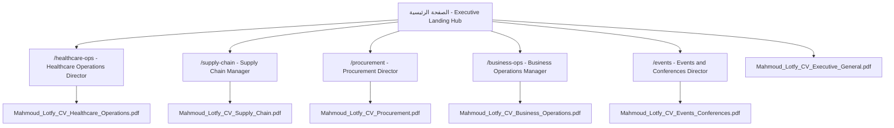

# الدليل التنفيذي الشامل لتصميم ومحتوى الموقع المهني
## Executive Career Portfolio & Role-Driven Dossiers
### Mahmoud Mohamed Lotfy — `mlotfy88.github.io`

---

> [!NOTE]
> **الغرض من هذا المستند:**  
> تقديم **وصف بصري وهيكلي وتفصيلي كامل** للموقع المنفذ بالفعل؛ بحيث يتمكن أي قارئ متخصص أو مستشار توظيف أو مراجع خارجي من **تخيل شكل الموقع تماماً وكأنه يراه بعينه**، ومراجعة نصوصه ومؤشراته وأقسامه بدقة لإبداء الرأي وتقديم الملاحظات.

> [!IMPORTANT]
> **نسخة محدّثة بعد تطبيق ملاحظات الخبير الاستراتيجي:**  
> تم تطبيق التعديلات التالية بناءً على مراجعة متخصصة:
> - تعديل التموضع من "Executive Operating Dossier" إلى **"Cross-Functional Operations Leader"** لتقليل الدراماتيكية وزيادة المصداقية.
> - مراجعة وتدقيق جميع الأرقام والمؤشرات: حذف `+37.0% Revenue 3-Year CAGR` واستبداله بـ `+65.5% Revenue Expansion`، حذف `3,570+ Hrs` لعدم إمكانية التحقق منها.
> - تعديل نبرة المنهجية من "بنيت الأنظمة بالغريزة ثم اكتشفت أنها PDCA" إلى **"أسلوبي العملي يتوافق طبيعياً مع أطر التحسين المستمر المعتمدة"**.
> - تحديث تسميات دراسات الحالة إلى مصطلحات مهنية احترافية: **Diagnosis → Intervention → System/Action → Measured Outcome**.
> - تبسيط قائمة التنقل إلى: **Career Paths، How I Work، Evidence & CVs، Contact**.
> - توضيح معمارية الـ CVs: **5 ملفات أساسية + 2 مسارات متخصصة + 1 ماستر**.

---

# الجزء الأول: فلسفة التصميم والهوية البصرية والمعمارية الرقمية

### 1. الفلسفة العامة (Design Persona & Feel)
- **الطابع العام:** الموقع لا يشبه الـ Portfolios الشخصية الاستعراضية، بل صُمم كـ **Executive Career Portfolio** احترافي يقدم أدلة تشغيلية مدققة بأسلوب يشبه التقارير المعتمدة في مجالس الإدارة.
- **الهدف الوظيفي:** إعطاء مسؤول التوظيف (HR) أو المدير التنفيذي (CEO / COO) قدرة على **مسح الموقع وفهم القيمة الحقيقية في 30 إلى 60 ثانية** دون أي تشتيت أو حركات استعراضية بطيئة.
- **قاعدة الإثبات (Evidence-Based Positioning):** كل رقم أو إنجاز مالي أو تشغيلي في الموقع مدعوم بدليل وأرقام رسمية مدققة. لا توجد أرقام لا يمكن التحقق منها.

### 2. لوحة الألوان المعتمدة (Color Palette)
| العنصر | كود اللون | الوصف والاستخدام |
| :--- | :--- | :--- |
| **خلفية الموقع العامة** | `#080C0E` | أسود كحلي تنفيذي عميق (Executive Obsidian Dark)، مع توهجات خافتة جداً في الخلفية تعطي عمقاً فخماً. |
| **خلفية الكروت والأقسام** | `#0E1418` | رمادي فحمي داكن مرتفع عن الخلفية مع حدود رفيعة جداً `rgba(255, 255, 255, 0.08)` تعطي فصلاً بصرياً حاداً وأنيقاً. |
| **اللون الزمردي المميز (Primary Accent)** | `#0D6B52` / `#34D399` | أخضر زمردي داكن وفاخر، يمثل الاستقرار والنمو المالي والتشغيلي، ويستخدم للأرقام القياسية والبادجات الإيجابية. |
| **النصوص والعناوين الرئيسية** | `#FFFFFF` | أبيض ناصع مع تباين 100% لسهولة القراءة السريعة. |
| **النصوص الثانوية والفقرات** | `#CBD5E1` & `#94A3B8` | درجات الرمادي الفضي الهادئ غير المجهدة للعين. |
| **لون التمييز الذهبي** | `#E5A93C` | ذهبي دافئ يُستخدم للعناوين الفرعية للأدوار المتخصصة ولبادج التوصية. |
| **كروت التحديات** | `rgba(239, 68, 68, 0.06)` | خلفية حمراء باهتة مع خط أحمر هادئ `#F87171` لعرض "التشخيص" في دراسات الحالة. |

### 3. الخطوط والطباعة (Typography)
- **العناوين الرئيسية (Headings):** خط **Outfit** (أوزان 700 و 800) — خط هندسي حديث، قوي وواضح يعطي انطباعاً قيادياً حاسماً.
- **الفقرات والنصوص (Body Text):** خط **Inter** (أوزان 400 و 500 و 600) — المعيار العالمي للقراءة المريحة على الشاشات.
- **الأرقام والمؤشرات القياسية (Metrics):** خط **JetBrains Mono** — خط أرقام أحادي المسافة (Monospaced) يظهر الأرقام والنسب كبيانات مالية مدققة.

### 4. معمارية الروابط العميقة (Deep Link Architecture)
الموقع **ليس صفحة واحدة طويلة** يضيع فيها القارئ، بل يتكون من **6 صفحات مستقلة تماماً**:

- كل دور وظيفي يمتلك **صفحة مستقلة برابط مخصص** يمكن إرساله للـ HR مباشرة؛ فيفتح مسؤول التوظيف ليجد فقط ما يخص الوظيفة المستهدفة (بدون تشتيت).
- تم إلغاء نسخ الوورد (.docx) والاكتفاء بتحميل **نسخ PDF رسمية معتمدة** تمت تسميتها بأسماء واضحة باسم محمود واسم التخصص.
- التواجد والحراك الجغرافي موحد في جميع الصفحات: **"الإسكندرية، مصر · ومتاح للعمل التنفيذي والحضوري في: القاهرة، الإسكندرية، والشرقية"**.

---

# الجزء الثاني: العناصر الثابتة (Header & Footer)

### 1. الشريط العلوي التنفيذي (Executive Navbar)
- **الشكل والمكان:** شريط عائم مثبت بأعلى الشاشة (Fixed Top) بارتفاع 72px، بخلفية زجاجية معتمة بنسبة 94% بخاصية Blur، وحد سفلي زمردي خافت.
- **الجانب الأيسر (الهوية):**
  - السطر الأول: **MAHMOUD MOHAMED LOTFY** (أبيض، عريض جداً 800).
  - السطر الثاني: **EXECUTIVE CAREER PORTFOLIO** (أخضر زمردي صغير 0.72rem).
- **المنتصف (روابط التنقل):**
  - `Overview`: يعود للصفحة الرئيسية.
  - `Career Paths` (قائمة منسدلة أنيقة): تفتح نافذة سوداء بعرض 320px تحتوي على الـ 5 أدوار مع أيقونات ووصف موجز لكل دور. العنوان الداخلي: "Select Professional Lens".
  - `How I Work`: ينزل بسلاسة لقسم منهجية العمل (7-Step Method).
  - `Evidence & CVs`: ينزل لقسم ملفات السيرة الذاتية.
  - `Contact`: ينزل لقسم التواصل والتواجد الجغرافي.
- **الجانب الأيمن (الإجراء المباشر):**
  - زر رمادي داكن بحواف مضيئة: `LinkedIn ↗` يفتح البروفايل مباشرة.
  - أيقونة قائمة الموبايل تظهر تلقائياً على الشاشات الصغيرة وتفتح Drawer كامل ومرتب.

### 2. الفوتر التنفيذي (Footer)
- **الشكل والمكان:** خلفية سوداء كاحلة `#05080A` بارتفاع مريح وحد علوي رمادي ناعم.
- **الأعمدة الأربعة:**
  1. **عمود الهوية:** اسم محمود لطفي، التخصصات الرئيسية، ومقولته التنفيذية: *"I solve operational and business problems by connecting strategy, execution, financial discipline, people, and process."*
  2. **عمود الملفات التخصصية (Targeted Dossiers):** روابط مباشرة لصفحات الأدوار الخمسة.
  3. **عمود الروابط التنفيذية (Executive Hub):** روابط Overview، المنهجية، التواصل، ورابط مباشر باللون الزمردي لتحميل السيرة الذاتية العامة: `Executive General CV (PDF)`.
  4. **عمود قنوات الاتصال:** الإيميل المباشر، رقم الهاتف، ورابط بروفايل LinkedIn، وزر دائري أنيق `Back to Top`.
- **الشريط السفلي:** حقوق الملكية لسنة 2026 + عبارة: `Alexandria, Egypt · Available for: Cairo, Alexandria & Sharkia`.

---

# الجزء الثالث: تفصيل الصفحة الرئيسية (Page 1: Executive Landing Hub)

هذه الصفحة صُممت كـ "بوابة تنفيذية شاملة" لأي زائر، وتعرض القيمة الكلية في تتابع هرمي دقيق:

```
[ شريط التنقل العلوي Executive Navbar ]
       ↓
[ 1. قسم البطل Hero: الاسم + التموضع + ملخص القيمة المقترحة + أزرار الدعوة ]
       ↓
[ 2. شبكة إثبات الكفاءة: 6 Pillars of Operational Proof (Demonstrated Proof Signals) ]
       ↓
[ 3. مسارات الأدوار المتخصصة (Targeted Executive Dossiers: 5 كروت كاملة) ]
       ↓
[ 4. التطور والمسار المهني عبر 15+ عاماً (3 مراحل واقعية متتابعة) ]
       ↓
[ 5. كيف أعمل: إطار العمل التشغيلي من 7 خطوات (The 7-Step Framework) ]
       ↓
[ 6. قنوات التواصل والتواجد الجغرافي (Initiate Direct Dialogue) ]
       ↓
[ الفوتر التنفيذي Footer ]
```

---

### القسم الأول: Hero — التعريف والتموضع الاستراتيجي
- **البادج العلوي:**
  - بادج زمردي بيضاوي: `Executive Career Portfolio & Dossiers`
- **العناوين الرئيسية:**
  - العنوان الكبير (H1): **MAHMOUD MOHAMED LOTFY** (أبيض، خط Outfit عريض جداً `clamp(2.5rem, 5.5vw, 4.2rem)`، مع تدرج لوني من الأبيض النقي للرمادي الفضي).
  - **اللقب التنفيذي الديناميكي:**
    - في الوضع العام (بدون دور محدد): **"A Cross-Functional Operations Leader Who Turns Complex Operations Into Measurable Systems"** (أخضر زمردي لامع).
    - عند اختيار دور محدد: يتغير ديناميكياً ليعرض `Target Position: [اسم الدور] — [العنوان الفرعي]` (ذهبي).
- **صندوق ملخص القيمة المقترحة (Value Proposition Box):**
  - **الشكل:** كارت زجاجي عريض بحافة يسرى سميكة زمردية وخلفية متدرجة.
  - **الاقتباس بالخط المائل:**
    > *"Healthcare Operations - Supply Chain - Procurement - Business Operations - Events"*
  - **الفقرة التنفيذية المفصلة:**
    > *"Over 15+ years of multi-sector professional experience (including 5+ years in high-acuity healthcare operations leadership), I have transformed complex operational environments into measurable, controlled, and repeatable operating systems. In a high-acuity Cardiac Catheterization Unit (Cath Lab) with an operating range of 90–140 procedures per month (averaging ~66 complex cases/mo; 399 documented in H1 2025), I delivered +56.3% net profit growth and +65.5% gross revenue expansion, maintained 100% stock availability, and achieved zero procedure cancellations due to supply failure across 30+ consecutive months—while maintaining performance despite >70% cost inflation and building 4 custom internal operational platforms using AI-assisted tools on zero external software budget."*

> [!TIP]
> **ملاحظة التدقيق:** تم حذف ادعاء "3-Year CAGR +37.0%" واستبداله بـ "+65.5% Revenue Expansion" لأنه أوضح وأكثر قابلية للتحقق (نمو من EGP 5.85M إلى EGP 9.68M). تم حذف "3,570+ ساعة عمل" لعدم إمكانية التحقق منها.

- **أزرار الدعوة للإجراء (Action Buttons):**
  1. زر رئيسي زمردي مشع: `Explore 5 Career Dossiers` ينقل الزائر مباشرة لكروت التخصصات.
  2. زر رمادي أنيق مع أيقونة تحميل: `Download Executive CVs` ينقل لقسم الـ CV Hub.
  3. زر نصي ناعم: `How I Work (7-Step Method)` ينقل لقسم المنهجية.

- **شريط المعلومات السريعة (Quick Info Bar):**
  - `Cairo - Alexandria - Sharkia, Egypt`
  - `Available for Immediate Start`
  - `m.m.lotfy.88@gmail.com` (رابط إيميل مباشر)
  - `LinkedIn` (رابط البروفايل)
  - `GitHub` (رابط بروفايل GitHub: `github.com/MLotfy88`)

---

### القسم الثاني: 6 أركان إثبات الكفاءة التشغيلية (6 Pillars of Operational Proof)

> [!IMPORTANT]
> **التعديل الجوهري بعد ملاحظات الخبير:** تم إعادة هيكلة المؤشرات من 6 كروت عامة إلى **6 أركان إثبات احترافية** (Demonstrated Proof Signals) مصنفة تحت عناوين تشغيلية محددة، مع حذف أي مؤشر غير قابل للتحقق.

- **عنوان القسم الرئيسي:**
  - البادج: `Demonstrated Proof Signals`
  - العنوان: **6 Pillars of Operational Proof**
  - العنوان الفرعي: *"Verifiable operational realities spanning financial turnaround, high-acuity clinical throughput, zero-defect reliability, and practical system-building."*

- **شبكة الكروت الستة:**
  - كل كارت يتضمن: أيقونة ملونة داخل مربع رمادي، الرقم الكبير (خط عريض 2.6rem)، المسمى، السياق التوثيقي، وعنوان التصنيف أسفل الكارت.
  - كل كارت يحمل بادج صغير `Audited KPI` وخط زمردي متوهج أعلاه.

| # | الرقم | المسمى | السياق التوثيقي | التصنيف |
| :---: | :--- | :--- | :--- | :--- |
| 1 | **+56.3%** | YoY Net Profitability Growth | Surged to EGP 2,978,995 in H1 2025 (vs EGP 1,905,803 in H1 2024), verified in official hospital financial audits. | Financial Impact and P&L Stewardship |
| 2 | **90-140** | Monthly Procedures — Operating Range | Historical operating range · 399 documented cases in H1 2025 (~66/month average). | Clinical Scale and High-Acuity Throughput |
| 3 | **ZERO** | Supply-Failure Cancellations | Zero procedural cancellations due to stock or supply failure sustained across 30+ consecutive months. | Mission-Critical Operational Reliability |
| 4 | **20+** | Conferences and Events Directed | Directed premier international medical congresses (Cairo Derma, Vascular Surgery), academic symposia, and TEDx Zagazig. | Multi-Stakeholder Event Operations (On-Budget) |
| 5 | **15+** | Years Multi-Sector Experience | Cross-functional career spanning Healthcare, FMCG Manufacturing, HealthTech SaaS, Telecom, Media, and Live Events. | Accumulated Operational Breadth (2008 - 2026) |
| 6 | **4 Systems** | Operational Platforms Built | Built 4 custom internal operational platforms using AI-assisted tools on EGP 0 external budget. | Digital Transformation as an Operational Enabler |

- **شريط المؤشرات الثانوية (Secondary Operational Stats Bar):**
  - شريط مستطيل أسود مقسم لـ 5 أعمدة:

| الرقم | المسمى | السياق |
| :--- | :--- | :--- |
| 100% | Critical Stock Availability | Sustained across 3 consecutive fiscal years for 50+ item codes |
| +65.5% | Revenue Expansion | Grew from EGP 5.85M (2024) to EGP 9.68M (2025) across Cath Lab operations |
| 40-60% | Emergency Purchasing Reduction | Achieved via procedure-linked clinical replenishment modeling |
| >70% | Cost Inflation Mitigated | Performance maintained despite severe currency devaluations |
| 6 Tools | Analytical Decision Models | Excel and Sheets reconciliation tools governing consignments, inventory, and pricing |

---

### القسم الثالث: مسارات الأدوار المتخصصة (Targeted Executive Dossiers)
- **الشكل العام:** شبكة كروت تنفيذية واسعة (`minmax(340px, 1fr)`). كل كارت مزود بتأثير حركي ناعم (Hover Lift) مع إضاءة خفيفة للحدود عند اقتراب الفأرة.
- **محتوى الكروت الخمسة:**

#### 1. كارت: Healthcare Operations
- **الأيقونة:** نبض القلب الطبي `Activity` داخل مربع زمردي.
- **البادج العلوي:** `Target: Healthcare Operations Director`
- **العنوان:** **Healthcare Operations**
- **العنوان الفرعي:** Cardiac Catheterization Unit - Clinical Workflows - Zero Supply Disruptions
- **نص الكارت:**
  > *"Direct management of a high-volume interventional Cardiac Catheterization Unit (90-140 cases/mo), delivering +56.3% YoY net profit growth and zero procedural cancellations across 30+ months."*
- **شريط الأرقام الثلاثية داخل الكارت:**
  - `+56.3%` Net Profit YoY | `90-140` Monthly Procedures | `ZERO (30+ Mos)` Supply Cancellations
- **الأزرار السفلية:**
  - زر نصي زمردي: `Open Role Dossier` ينقل لصفحة `/#/healthcare-ops`.
  - زر رمادي جانبي: `CV PDF` يحمل مباشرة `Mahmoud_Lotfy_CV_Healthcare_Operations.pdf`.

#### 2. كارت: Supply Chain Management
- **الأيقونة:** شاحنة لوجستية `Truck`.
- **البادج العلوي:** `Target: Supply Chain Manager`
- **العنوان:** **Supply Chain Management**
- **العنوان الفرعي:** Procedure-Linked Demand Models - 1-Hour SLAs - Zero Stockouts
- **نص الكارت:**
  > *"Engineered procedure-linked demand forecasting models that reduced emergency purchasing by 40-60%, maintained 100% stock availability for 3 fiscal years, and enforced 1-Hour emergency vendor SLAs."*
- **شريط الأرقام الثلاثية:**
  - `-40% to -60%` Emergency Orders | `100%` Stock Availability | `1-Hr MAX` Vendor SLA
- **الأزرار السفلية:**
  - `Open Role Dossier` ينقل لصفحة `/#/supply-chain`.
  - `CV PDF` يحمل `Mahmoud_Lotfy_CV_Supply_Chain.pdf`.

#### 3. كارت: Strategic Procurement and Sourcing
- **الأيقونة:** حقيبة الشراء والمناقصات `ShoppingBag`.
- **البادج العلوي:** `Target: Procurement Manager / Director`
- **العنوان:** **Strategic Procurement and Sourcing**
- **العنوان الفرعي:** 3-Criteria Sign-Off - Currency Crisis Resilience - Contract Auditing
- **نص الكارت:**
  > *"Instituted a 3-criteria procurement sign-off protocol, audited 100% of supplier invoices against master price books, and mitigated >70% currency-driven cost inflation through forward volume commitments."*
- **شريط الأرقام الثلاثية:**
  - `>70%` Inflation Absorbed | `20-30%` Overdue Balances Cut | `250%` Commercial ROMI
- **الأزرار السفلية:**
  - `Open Role Dossier` ينقل لصفحة `/#/procurement`.
  - `CV PDF` يحمل `Mahmoud_Lotfy_CV_Procurement.pdf`.

#### 4. كارت: Business Operations
- **الأيقونة:** حقيبة الأعمال التنفيذية `Briefcase`.
- **البادج العلوي:** `Target: Business Operations Lead / Director`
- **العنوان:** **Business Operations**
- **العنوان الفرعي:** Full P&L Stewardship (~20% Revenue) - Systemic Scaling - Margin Protection
- **نص الكارت:**
  > *"Led departmental P&L accountability contributing ~20% of hospital revenue, restructured operations through a 7-step execution framework, and delivered compounding profit expansion."*
- **شريط الأرقام الثلاثية:**
  - `~20%` Hospital Revenue | `4 Platforms` Systems Built | `+56.3%` Net Profit YoY
- **الأزرار السفلية:**
  - `Open Role Dossier` ينقل لصفحة `/#/business-ops`.
  - `CV PDF` يحمل `Mahmoud_Lotfy_CV_Business_Operations.pdf`.

#### 5. كارت: Events and Conferences
- **الأيقونة:** تقويم الفعاليات `Calendar`.
- **البادج العلوي:** `Target: Events and Conferences Director`
- **العنوان:** **Events and Conferences**
- **العنوان الفرعي:** 20+ Executed Events - Zagazig Med Faculty and Cairo Derma - TEDx Zagazig Co-Founder
- **نص الكارت:**
  > *"Directed 20+ large-scale events and medical congresses for Zagazig University Faculty of Medicine and Egyptian medical societies, co-founded TEDx Zagazig, and spent 5 years in commercial media production."*
- **شريط الأرقام الثلاثية:**
  - `20+ Events` Executed Events | `On-Budget` Budget Performance | `2,000+ Attendees` Job Fair Scale
- **الأزرار السفلية:**
  - `Open Role Dossier` ينقل لصفحة `/#/events`.
  - `CV PDF` يحمل `Mahmoud_Lotfy_CV_Events_Conferences.pdf`.

---

### القسم الرابع: التطور والمسار المهني عبر 15+ عاماً (Cross-Sector Evolution)
- **الغرض التنفيذي:** يوضح كيف أن مهارات محمود ليست مجرد خبرة في مكان واحد، بل سلسلة تراكمية متكاملة تفسر تميزه.
- **التصميم:** 3 كروت مستطيلة عريضة متتابعة رأسياً، كل كارت يمثل مرحلة كاملة:

```
[ المرحلة الأولى: الفعاليات والمؤتمرات الطبية الحية والإنتاج الإعلامي (2011-2014) ]
                                ↓
[ المرحلة الثانية: إدارة المستودعات وحفظ الخامات بنظام FIFO بمصنع حلويات (2015-2017) ]
                                ↓
[ المرحلة الثالثة: قيادة العمليات الصحية وإدارة الـ P&L بقسطرة القلب (2018-2026) ]
```

- **نصوص المراحل الثلاث بالتفصيل:**
  1. **Phase 1: High-Stakes Live Execution and Media Production (2011 - 2014)**
     - التخصص: `Events, Media Production and Entrepreneurship`
     - السرد: *"Organized premier medical congresses for Zagazig University Faculty of Medicine departments (Vascular Surgery, Cairo Derma) and co-founded TEDx Zagazig. Directed on-site operations for high-budget commercial TV campaigns (Vodafone, Huawei) managing 50+ personnel crews under extreme time sensitivity and financial penalties."*
     - الخلاصة القيادية: `Core Leadership Takeaway: Mastered high-tempo execution, stakeholder protocol, and zero-defect live delivery.`
  2. **Phase 2: Stores, Inventory and Raw Material Control (2015 - 2017)**
     - التخصص: `Sweets and Confectionery Facility (Verona Sweets / IBS)`
     - السرد: *"Supervised stores, raw material staging, packaging, and finished goods inventory for a local confectionery manufacturing business. Enforced strict FIFO stock rotation to prevent ingredient spoilage, synchronized daily material staging with production shift requirements, and maintained clean physical vs ledger records."*
     - الخلاصة القيادية: `Core Leadership Takeaway: Built foundational discipline in inventory accuracy, FIFO physical stock rotation, and raw material waste prevention.`
  3. **Phase 3: Specialized Healthcare Operations and P&L Leadership (2018 - 2026)**
     - التخصص: `Healthcare Clinical Administration and Cath Lab (Al-Obour Hospital)`
     - السرد: *"Directed end-to-end clinical operations of a high-volume Cardiac Catheterization Unit (90-140 procedures/month) with full P&L ownership representing ~20% of hospital revenue. Delivered +56.3% YoY net profit growth and zero supply failure cancellations across 30+ months under >70% currency-driven cost inflation."*
     - الخلاصة القيادية: `Core Leadership Takeaway: Integrated financial discipline, clinical governance, and mission-critical supply resilience.`

---

### القسم الخامس: منهجية التفكير الشاملة — الانضباط التشغيلي المستمر (Continuous Operational Discipline)

> [!IMPORTANT]
> **التعديل الجوهري بعد ملاحظات الخبير:** تم تعديل النبرة من "بنيت الأنظمة بالفطرة واكتشفت لاحقاً أنها تطابق DMAIC" إلى نبرة أكثر تواضعاً واحترافية: **"أسلوبي العملي يتوافق طبيعياً مع أطر التحسين المستمر المعتمدة مثل PDCA و DMAIC و Lean"**.

- **كارت الفلسفة التأسيسية:**
  - العنوان: **Continuous Operational Discipline**
  - المقولة: *"My practical approach naturally overlaps with established continuous-improvement frameworks such as PDCA, DMAIC, and Lean principles."*
  - النص التأسيسي:
    > *"When facing an operational unit in distress or fragmented workflows—whether in healthcare administration, factory warehousing, or high-stakes live productions—effective leadership begins on the frontline. You observe real friction, diagnose root causes, build practical systems to stop unrecorded leakage, align supplier commitments, and train the team until excellence becomes the standard. This hands-on operational discipline naturally embodies the core tenets of continuous improvement, Deming's cycle, and Lean operations."*

- **المبادئ التأسيسية الثلاثة:**
  1. **Systemic Thinking Over Ad-Hoc Heroics:** *"Individual heroism is fragile and unscalable. Sustainable operations require institutionalized systems that make the right action the easiest action for every staff member on every shift."*
  2. **Technology as an Operational Enabler:** *"Software must never be built for its own sake or imposed as a bureaucratic burden. Every digital tool must directly eliminate a frontline friction point, automate an audit trail, or protect patient safety."*
  3. **Leadership Through Presence and Empathy:** *"You cannot optimize a clinical operating theater or a factory floor from an air-conditioned corner office. True operational authority is earned by standing beside your nurses, technicians, and team during high-pressure crises."*

- **المتصفح التفاعلي للخطوات السبع:**
  - شريط أزرار علوي يتنقل بين الخطوات: `OBSERVE` → `UNDERSTAND` → `DESIGN` → `BUILD` → `EXECUTE` → `MEASURE` → `IMPROVE`.
  - بطاقة عريضة تعرض الخطوة المختارة بالتفصيل: الإجراء الفعلي (Action)، الوصف (Description)، الأدوات المستخدمة (Tools)، والدليل الواقعي المحقق (Evidence).

| الخطوة | العنوان | الإجراء | الأدوات | الدليل الواقعي |
| :---: | :--- | :--- | :--- | :--- |
| 1 | OBSERVE | Understand frontline reality and identify operational friction. | Floor Shadowing, Process Mapping, Physical Stock Audits, Time Tracking. | Identified that procedural turnover delays stemmed from admission ticketing rather than surgical pacing. |
| 2 | UNDERSTAND | Diagnose root causes across people, process, data and resources. | Root-Cause Analysis (5 Whys), Value-Stream Mapping, Ledger Cross-Auditing. | Traced emergency purchasing spikes to a lack of synchronization between physician schedules and supplier ordering cutoffs. |
| 3 | DESIGN | Build practical workflows that reduce friction and operational risk. | Procedure-Linked Demand Logic, Staggered Shift Design, Dual-Custody Checklists. | Instituted a 3-tier patient intake protocol and closed-loop consignment custody workflow. |
| 4 | BUILD | Create the tools and controls needed to support the workflow. | Custom Web Applications & Operational Analytics (React, TypeScript, SQLite), Barcode Scanning, Financial Models. | Built 4 custom internal operational platforms using AI-assisted development tools, with EGP 0 external software spend. |
| 5 | EXECUTE | Implement with the team and adapt to frontline feedback. | Hands-On Coaching, SOP Checklists, Dual-Verification Routines. | Established adoption of targeted digital workflows across clinical, administrative, and inventory functions without disrupting active patient care. |
| 6 | MEASURE | Track objective operational and financial performance. | Daily Operations Dashboards, Financial Variance Reviews, Cycle Counts, Supplier Scorecards. | Generated documented departmental statements proving +56.3% net profit growth and 100% material stock availability. |
| 7 | IMPROVE | Institutionalize continuous improvement through measured results. | Quarterly Supplier Tendering, Case-Mix Reviews, Quality Retrospectives. | Sustained zero supply cancellations across 30+ consecutive months despite macroeconomic cost headwinds. |

---

### القسم السادس: التواصل والتواجد الجغرافي (Initiate Direct Dialogue)
- **الشكل:** مقسم لعمودين رئيسيين:
  - **العمود الأيسر (Direct Channels):**
    - كارت الإيميل الرسمي: `m.m.lotfy.88@gmail.com` مع أيقونة رسالة زمردية.
    - كارت الهاتف والواتساب المباشر: `+20 155 816 6440` مع أيقونة اتصال وزر يفتح محادثة واتساب فوراً.
    - كارت شبكة الأعمال: `linkedin.com/in/mmlotfy` مع أيقونة لينكد إن زرقاء.
  - **العمود الأيمن (Mobility and Geographic Scope):**
    - الموقع الحالي: `Alexandria, Egypt`
    - المنشأ وقاعدة العمليات: `Zagazig, Sharkia, Egypt`
    - الجاهزية للعمل الحضوري والتنفيذي: `Cairo - Alexandria - Sharkia, Egypt`
    - بوكس زمردي أسفله يؤكد: الجاهزية للبدء الفوري، والتفرغ للأدوار القيادية والاستشارات التشغيلية.

---

# الجزء الرابع: قسم ملفات السيرة الذاتية (CV Hub — Document Architecture)

> [!IMPORTANT]
> **التعديل بعد ملاحظات الخبير:** تم توضيح معمارية الملفات بشكل صريح لتبيان الفرق بين المسارات الأساسية والمتخصصة:

- **عنوان القسم:** `8 Targeted ATS-Compliant Executive CVs`
- **العنوان الفرعي:** *"Structured into 5 Primary Career Tracks, 2 Specialized Supply Chain Focus Areas, and 1 Comprehensive Master CV."*
- **بادجات المعمارية التوضيحية:**
  - بادج زمردي: `5 Primary Dossiers (Healthcare, Supply Chain, Procurement, Business Ops, Events)`
  - بادج أزرق: `2 Specialized Tracks (Demand Planning and Logistics under Supply Chain)`
  - بادج ذهبي: `1 Master Executive General CV`

- **آلية التوصية الذكية:** عند اختيار دور معين من القائمة المنسدلة، يظهر شريط توصية يحتوي على: `Currently viewing through [Role Name] lens. CV tailored for this position is highlighted below.` مع بادج `RECOMMENDED MATCH` على الملف المطابق.

- **شبكة الكروت الثمانية:** كل كارت يتضمن:
  - رقم الإصدار (`VERSION 01` - `VERSION 08`).
  - بادج نوع الملف (`Primary Dossier` / `Specialized Track` / `Executive General`).
  - العنوان والأدوار المستهدفة.
  - وصف مختصر ونقاط التمييز.
  - زر تحميل رئيسي: `Download Official CV (PDF)`.

---

# الجزء الخامس: تفصيل الصفحات التخصصية الخمس (Role-Specific Pages)

صُممت كل صفحة من الصفحات الخمس لتكون **سيرة ذاتية تفاعلية مدعومة بالأدلة (Evidence-Based Dossier)** لا تستغرق قراءتها أكثر من دقيقتين.

> [!IMPORTANT]
> **التعديل بعد ملاحظات الخبير:** تم تغيير تسميات أقسام دراسات الحالة من العناوين القديمة إلى مصطلحات مهنية احترافية:
> - "ما كانت المشكلة" أصبحت **Diagnosis** (التشخيص)
> - "ما رأيته وما فعلته" أصبحت **Intervention** (التدخل)
> - "ما بنيته" أصبحت **System / Action** (النظام المبني / الإجراء)
> - "النتيجة المدققة" أصبحت **Measured Outcome** (النتيجة المقاسة)

---

## الصفحة الثانية: Healthcare Operations Director
**الرابط المباشر:** `mlotfy88.github.io/#/healthcare-ops`

### 1. رأس الصفحة (Role Hero):
- مسار العودة: `Back to Executive Career Hub`
- بادج: `CARDIAC CATHETERIZATION AND CLINICAL OPERATIONS`
- العنوان الكبير: **Healthcare Operations Director**
- العنوان الفرعي: High-Volume Cath Lab Leadership - Clinical Workflow Turnaround - Zero-Failure Supply Governance
- **صندوق القيمة المقترحة (Value Proposition Box):**
  > *"Managed end-to-end operations of a high-volume Cardiac Catheterization Unit (90-140 procedures/month), delivering +56.3% YoY net profit growth while maintaining ZERO supply failures across 30+ months — under >70% macroeconomic cost inflation."*
- **شريط تحميل الملف والتواصل:**
  - زر زمردي وحيد: `Download Healthcare Operations CV (PDF)` (يحمل `Mahmoud_Lotfy_CV_Healthcare_Operations.pdf`).
  - أزرار سريعة لمراسلة الإيميل أو الاتصال بالهاتف مباشرة.

### 2. شبكة الأرقام المدققة (6 Key Metrics):
1. `+56.3%` Net Profit Growth YoY (Audited H1 2024 vs H1 2025 under >70% cost inflation)
2. `+65.5%` Revenue Expansion (Gross revenue grew from EGP 5.85M to EGP 9.68M in audited statements)
3. `ZERO` Supply Failure Cancellations (30+ consecutive months with 100% procedure readiness)
4. `90-140` Monthly Procedure Volume (Diagnostic angiographies, PCIs, and pacemaker implants)
5. `~45 Staff` Team Leadership (Nursing staff, surgical technicians, coordinators and admin)
6. `100%` Equipment Readiness (Zero unplanned imaging shutdowns; 1-Hour MAX vendor SLA)

### 3. دراسات الحالة الثلاث (Diagnosis - Intervention - System/Action - Measured Outcome):
- **قصة 1: From Clinical Accountant to Operations Lead**
  - *Diagnosis:* عزلة وحدة القسطرة إدارياً عن إدارة المستشفى وتضارب أولويات الجراحين والتمريض والمحاسبين.
  - *Intervention:* رسم دورة حياة المريض والمستلزمات خطوة بخطوة وتقديم خطة إعادة هيكلة شاملة.
  - *System/Action:* بروتوكولات تشغيل يومية قياسية ونماذج استهلاك سريري متزامنة.
  - *Measured Outcome:* إنهاء الاحتكاك الإداري ومواءمة جداول الجراحة مع توفر المستلزمات.
- **قصة 2: Zero Supply Cancellations for 30+ Consecutive Months**
  - *Diagnosis:* الاعتماد على الطلب العشوائي للدعامات والبالونات المستوردة الباهظة.
  - *Intervention:* بناء نموذج تنبؤ طلب ديناميكي مرتبط بقوائم العمليات المحجوزة.
  - *System/Action:* نظام إدارة مخزون رقمي مزود بقراءة الباركود وتنبيهات إعادة الطلب.
  - *Measured Outcome:* صفر إلغاء للعمليات بسبب نقص المستلزمات على مدار 30+ شهراً.
- **قصة 3: Delivering +56.3% Net Profit Under Severe Cost Inflation**
  - *Diagnosis:* قفزة في تكاليف المستلزمات الطبية المستوردة بنسبة +69.9%.
  - *Intervention:* تطبيق التسعير الديناميكي وتدقيق 100% من فواتير الموردين.
  - *System/Action:* إعادة توجيه الطاقة التشغيلية لحالات الـ Private category وبرنامج تسويق مباشر.
  - *Measured Outcome:* صافي ربح قياسي 2,978,995 جنيه (+56.3% نمو) ونمو الإيرادات +65.5%.

### 4. التمكين الرقمي (Digital Enabler Box):
- يوضح الأنظمة التي بناها محمود لخدمة القسم بصفر ميزانية خارجية:
  1. منظومة مؤشرات أداء التمريض (Nursing KPI System)
  2. نظام التقارير الطبية (Medical Diagnostic Reports)
  3. نظام تتبع مخزون القسطرة والباركود

---

## الصفحة الثالثة: Supply Chain Manager
**الرابط المباشر:** `mlotfy88.github.io/#/supply-chain`

### 1. رأس الصفحة:
- بادج: `MEDICAL DEVICES AND CRITICAL CONSUMABLES`
- العنوان: **Supply Chain Manager**
- العنوان الفرعي: Demand Forecasting - Consignment Governance - 1-Hour Emergency SLAs - Zero Disruptions
- **القيمة المقترحة:**
  > *"Built and managed a procedure-linked demand forecasting model that reduced emergency purchasing by 40-60%, maintained 100% stock availability across 3 fiscal years, and achieved ZERO supply disruptions for 30+ consecutive months."*
- **زر التحميل:** `Download Supply Chain Management CV (PDF)` (ملف `Mahmoud_Lotfy_CV_Supply_Chain.pdf`).

### 2. شبكة الأرقام المدققة:
1. `ZERO` Supply Disruptions | 2. `40-60%` Emergency Purchasing Reduction | 3. `100%` Critical Stock Availability | 4. `1 Hour MAX` Vendor Emergency Response SLA | 5. `100%` Physical vs Ledger Accuracy | 6. `>70%` Cost Inflation Absorbed

---

## الصفحة الرابعة: Procurement Director
**الرابط المباشر:** `mlotfy88.github.io/#/procurement`

### 1. رأس الصفحة:
- بادج: `STRATEGIC SOURCING AND COMMERCIAL NEGOTIATIONS`
- العنوان: **Procurement & Strategic Sourcing** (Target Role: Procurement Manager / Director)
- العنوان الفرعي: 3-Criteria Sign-Off - Inflation Mitigation (>70%) - Master Price Books - Working Capital Recovery
- **القيمة المقترحة:**
  > *"Strategic procurement leader who instituted a rigorous 3-criteria sign-off protocol, managed high-value medical consumables procurement under extreme currency shocks, and maintained strict commercial discipline while maintaining performance despite >70% cost inflation."*
- **زر التحميل:** `Download Procurement and Sourcing CV (PDF)` (ملف `Mahmoud_Lotfy_CV_Procurement.pdf`).

### 2. شبكة الأرقام المدققة:
1. `40-60%` Emergency Purchasing Reduction | 2. `>70%` Cost Inflation Mitigated | 3. `20-30%` Outstanding Balances Recovered | 4. `100%` Invoices Audited | 5. `3 Criteria` Procurement Sign-Off Protocol | 6. `250%` Commercial Marketing ROMI

---

## الصفحة الخامسة: Business Operations Manager
**الرابط المباشر:** `mlotfy88.github.io/#/business-ops`

### 1. رأس الصفحة:
- بادج: `CROSS-FUNCTIONAL LEADERSHIP AND P&L STEWARDSHIP`
- العنوان: **Business Operations Manager**
- العنوان الفرعي: P&L Ownership (~20% Hospital Revenue) - Operational Discipline - Zero-Budget Systems - Compounding Growth
- **القيمة المقترحة:**
  > *"Cross-functional operations leader with full P&L accountability (~20% of hospital revenue), building high-governance KPI systems and delivering 3 consecutive years of compounding profit growth."*
- **زر التحميل:** `Download Business Operations CV (PDF)` (ملف `Mahmoud_Lotfy_CV_Business_Operations.pdf`).

### 2. شبكة الأرقام المدققة:
1. `+56.3%` Net Profit Growth YoY | 2. `+65.5%` Revenue Expansion | 3. `~20%` Hospital Revenue Share | 4. `100%` Process Digitization | 5. `~45 Staff` Cross-Functional Team | 6. `4 Systems` Operational Platforms Built

> [!TIP]
> **ملاحظة تدقيق:** تم حذف `3,570+ Hrs` (Development Investment) من هذه الصفحة بناءً على ملاحظات الخبير لعدم إمكانية التحقق منها. تم استبدالها بـ `4 Systems` كمؤشر واقعي قابل للإثبات.

---

## الصفحة السادسة: Events and Conferences Director
**الرابط المباشر:** `mlotfy88.github.io/#/events`

### 1. رأس الصفحة:
- بادج: `MEDICAL CONGRESSES AND HIGH-STAKES PRODUCTION`
- العنوان: **Events and Conferences Director**
- العنوان الفرعي: 20+ Executed Events - Zagazig Med Faculty and Cairo Derma - TEDx Zagazig Co-Founder - Commercial Media Direction
- **القيمة المقترحة:**
  > *"Conferences and events director with 20+ executed events including signature medical conferences for Zagazig University Faculty of Medicine departments, co-founder of TEDx Zagazig, combining insider medical operations knowledge with creative production, stakeholder management, and live execution discipline."*
- **زر التحميل:** `Download Events and Communications CV (PDF)` (ملف `Mahmoud_Lotfy_CV_Events_Conferences.pdf`).

### 2. شبكة الأرقام المدققة:
1. `20+ Events` Total Executed Events | 2. `Multiple Depts` Medical Conferences | 3. `TEDx Zagazig` TEDx Platform Co-Founder | 4. `5 Years` Commercial Media Track Record | 5. `2,000+ Attendees` Job Fair Scale Directed | 6. `Schedule Delivery: 100% On-Time` Event Execution

---

# الجزء السادس: ملخص ملفات السيرة الذاتية (CV Downloads)

تمت مطابقة وحفظ جميع الملفات داخل مسار `public/cv` بصيغة **PDF حصراً**:

| اسم الملف على السيرفر | الرابط الذي يظهر لـ HR | التخصص المستهدف | النوع |
| :--- | :--- | :--- | :--- |
| `Mahmoud_Lotfy_CV_Executive_General.pdf` | Executive General CV (PDF) | الصفحة الرئيسية والفوتر (الملف التنفيذي الماستر) | Master |
| `Mahmoud_Lotfy_CV_Healthcare_Operations.pdf` | Healthcare Operations CV (PDF) | صفحة إدارة العمليات الصحية وقسطرة القلب | Primary Dossier |
| `Mahmoud_Lotfy_CV_Supply_Chain.pdf` | Supply Chain Management CV (PDF) | صفحة إدارة سلاسل الإمداد ومستلزمات الجراحة | Primary Dossier |
| `Mahmoud_Lotfy_CV_Procurement.pdf` | Procurement and Sourcing CV (PDF) | صفحة إدارة المشتريات والمناقصات والعقود | Primary Dossier |
| `Mahmoud_Lotfy_CV_Business_Operations.pdf` | Business Operations CV (PDF) | صفحة إدارة العمليات وتطوير الأعمال وP&L | Primary Dossier |
| `Mahmoud_Lotfy_CV_Events_Conferences.pdf` | Events and Communications CV (PDF) | صفحة إدارة المؤتمرات والفعاليات والإنتاج | Primary Dossier |
| `Mahmoud_Lotfy_CV_Demand_Planning.pdf` | Demand Planning and Inventory CV (PDF) | متاح في المجلد لدعم أدوار تخطيط الطلب | Specialized Track |
| `Mahmoud_Lotfy_CV_Logistics_Operations.pdf` | Logistics Operations CV (PDF) | متاح في المجلد لدعم أدوار اللوجستيات | Specialized Track |

---

# الجزء السابع: سجل التعديلات بعد مراجعة الخبير (Change Log)

> [!NOTE]
> **ملخص التعديلات الجوهرية التي تم تطبيقها بناءً على مراجعة الخبير الاستراتيجي:**

| # | التعديل | التفاصيل | الملفات المتأثرة |
| :---: | :--- | :--- | :--- |
| 1 | **تعديل التموضع** | من "Executive Operating Dossier" إلى "Cross-Functional Operations Leader Who Turns Complex Operations Into Measurable Systems" | `identity.ts`, `Hero.tsx` |
| 2 | **حذف Revenue 3-Year CAGR** | حذف `+37.0% Revenue 3-Year CAGR` واستبداله بـ `+65.5% Revenue Expansion` (أوضح وأكثر قابلية للتحقق) | `metrics.ts`, `rolesData.ts`, `LandingPage.tsx` |
| 3 | **حذف 3,570+ Hrs** | حذف ادعاء "3,570+ ساعة عمل" لعدم إمكانية التحقق منه، واستبداله بـ "4 Systems" كمؤشر واقعي | `metrics.ts`, `rolesData.ts` |
| 4 | **تعديل نبرة المنهجية** | من "بنيت بالغريزة واكتشفت لاحقاً أنها PDCA" إلى "أسلوبي يتوافق طبيعياً مع أطر التحسين المستمر" | `methodology.ts` |
| 5 | **تحديث تسميات دراسات الحالة** | من "Problem - What I Saw - What I Built - Result" إلى "Diagnosis - Intervention - System/Action - Measured Outcome" | `CaseStudies.tsx` |
| 6 | **تبسيط التنقل** | من "Targeted Dossiers / Methodology / Contact and Mobility" إلى "Career Paths / How I Work / Evidence and CVs / Contact" | `ExecutiveNavbar.tsx` |
| 7 | **توضيح معمارية CVs** | إضافة بادجات توضيحية: "5 Primary + 2 Specialized + 1 Master" | `CvHub.tsx` |
| 8 | **تصحيح Event Metric** | من "0.0% Delay" إلى "Schedule Delivery: 100% On-Time" (صياغة إيجابية أوضح) | `rolesData.ts` |
| 9 | **استعادة رابط GitHub** | إعادة رابط GitHub Profile (`github.com/MLotfy88`) بعد حذفه بالخطأ في commit سابق | `Hero.tsx` |
| 10 | **تصحيح H1 2024 Baseline** | تصحيح الرقم من `EGP 1,905,945` إلى الرقم المدقق `EGP 1,905,803` | `metrics.ts`, `financials.ts`, `LandingPage.tsx` |
| 11 | **معايرة Hero Quote** | تحديث إلى "measurable, controlled, and repeatable" | `identity.ts` |
| 12 | **معايرة Monthly Procedures** | تحديث إلى "Monthly Procedures — Operating Range: 90–140" مع سياق H1 2025 | `metrics.ts` |
| 13 | **معايرة Team Size** | تحديث إلى "Operational Oversight · ~45 Personnel" | `LandingPage.tsx`, `rolesData.ts` |
| 14 | **معايرة المنهجية** | إعادة صياغة الـ 7 خطوات لتكون process-oriented وأقصر | `methodology.ts` |
| 15 | **إزالة Digital Overclaiming** | حذف "personally engineered software" واستبدالها بـ "built targeted internal operational tools" | `rolesData.ts`, `cvs.ts` |
| 16 | **توحيد Role Titles** | توحيد "Target Role: Healthcare Operations Director" عبر جميع الصفحات | `rolesData.ts`, `cvs.ts` |
| 17 | **إزالة high-margin** | استبدال "high-margin" بـ "Private category" في 5 مواضع | `rolesData.ts`, `financials.ts`, `caseStudies.ts` |
| 18 | **تحديث Navbar Subtitle** | من "EXECUTIVE CAREER DOSSIER" إلى "EXECUTIVE CAREER PORTFOLIO" | `ExecutiveNavbar.tsx` |

---

# الجزء الثامن: أسئلة استرشادية للمراجع المتخصص

عند إرسال هذا الملف لشخص متخصص لإبداء رأيه، يُنصح بتوجيه اهتمامه للنقاط الآتية:
1. **وضوح الرسالة:** هل يتمكن مسؤول التوظيف (HR) من فهم مجالك ونقاط قوتك الفاصلة خلال أول 30 ثانية من مطالعة الصفحة الرئيسية؟
2. **مصداقية الأرقام:** هل المؤشرات المعروضة (6 Pillars) تبدو قابلة للتحقق ومصاغة بأسلوب "Audit-Ready"؟
3. **نبرة التموضع الاحترافي:** هل العنوان "Cross-Functional Operations Leader" مناسب ومتوازن بين الطموح والواقعية؟
4. **قوة الأدلة:** هل صياغة دراسات الحالة (Diagnosis - Intervention - System/Action - Measured Outcome) تمنح الثقة التامة وتثبت أنك مدير عملي ميداني؟
5. **الهيكلية وتوزيع الأدوار:** هل تقسيم الموقع لـ 5 صفحات تخصصية مباشرة يحل إشكالية تشتت السيرة الذاتية ويجعل التقديم لكل وظيفة دقيقاً ومقنعاً؟
6. **نبرة التواضع والاحترافية:** هل صياغة تجربة مصنع فيرونا وتجربة المؤتمرات الطبية أصبحت متوازنة وواقعية تماماً وتخلو من أي تضخيم؟
7. **المنهجية:** هل صياغة "أسلوبي العملي يتوافق طبيعياً مع PDCA/DMAIC/Lean" أكثر مصداقية من الصياغة السابقة؟
